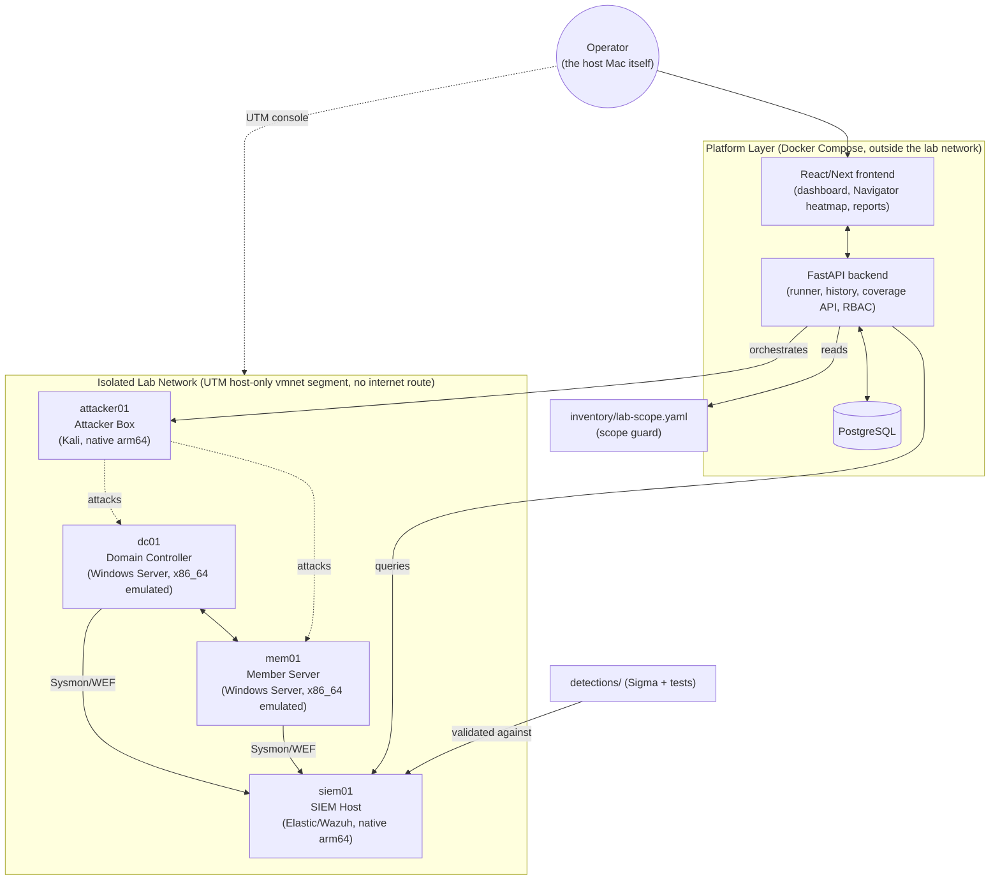

# EADADL — Enterprise Active Directory Attack & Detection Lab

[](/.github/workflows)
[](LICENSE)
[](ROADMAP.md)

A fully isolated, reproducible, **purple-team** laboratory plus a platform
layer that provisions a vulnerable Active Directory environment, orchestrates
attack scenarios against it, ships the resulting telemetry to a SIEM,
validates detections against that telemetry, and reports MITRE ATT&CK
coverage through a web UI.

This is a build-in-progress. **[ROADMAP.md](ROADMAP.md)** and
**[BUILD_LOG.md](BUILD_LOG.md)** are the source of truth for what is actually
done versus planned — this README describes the target architecture, not a
finished product.

## ⚠️ Authorized use only

This repository provisions a **deliberately vulnerable** Active Directory
environment and executes **real offensive security tooling** (NetExec,
Impacket, BloodHound/SharpHound, PowerView, Atomic Red Team, Caldera) against
it. It is built for defenders to practice detection engineering and for red
teamers to practice technique execution in a legal, contained setting.

- Only ever run this against infrastructure you own or are explicitly
  authorized to test.
- The attack engine refuses to target anything outside
  [`inventory/lab-scope.yaml`](inventory/lab-scope.yaml) — see
  [SECURITY.md](SECURITY.md) for the full list of safety invariants.
- This project does not contain novel exploits or malware. It orchestrates
  established, publicly documented tools and maps every technique to a
  published MITRE ATT&CK ID.

## Why this exists

Most "AD attack lab" projects stop at provisioning a vulnerable domain and
running a checklist of attacks by hand. EADADL treats the *detection engineer's
half of the loop* as equally important: every attack technique exercised here
is expected to ship a corresponding [Sigma](https://github.com/SigmaHQ/sigma)
detection rule, tested against the telemetry that technique actually
generates, with the resulting attack→detection coverage tracked and rendered
as an ATT&CK Navigator-style heatmap. It's a purple-team loop, not a red-team
demo.

## Architecture



*A standalone `wks01` workstation was dropped from this footprint to keep
emulated-x86_64 VM count low — see
[ADR 0004](docs/adr/0004-revert-to-local-utm.md). Reintroducing it is a
documented option, not a removed requirement.*

## Repository layout

```
eadadl/
├── inventory/     # lab-scope.yaml — the ONLY authorized attack targets
├── infra/         # Packer + UTM bundle generator — the AD environment as code (local)
├── config/        # Ansible roles: DC, members, attacker, SIEM
├── telemetry/     # Sysmon config, WEF/forwarding, SIEM shipping
├── attack/        # scenario engine: atomic techniques + chains, ATT&CK-tagged
├── detections/    # Sigma rules + tests, ATT&CK mapping, detection-as-code
├── platform/
│   ├── backend/   # FastAPI + PostgreSQL: runner, run history, coverage API
│   └── frontend/  # React/Next + Tailwind: dashboard, Navigator heatmap
├── ir/            # DFIR playbooks, hunting notebooks, response automation
├── docs/          # architecture notes, ADRs, runbooks
└── .github/workflows/  # CI: lint, test, detection validation, IaC checks
```

## Deployment target

`DEPLOY_TARGET=local`, running on UTM/QEMU (see
[`docs/adr/0004-revert-to-local-utm.md`](docs/adr/0004-revert-to-local-utm.md)
for the full reasoning, including why this was originally attempted on
Azure first). This Mac is Apple Silicon (arm64); Windows Server has no
practical ARM64 path, so `dc01`/`mem01` run under QEMU's software (TCG)
x86_64 emulation — genuine but slow — while `attacker01` (Kali) and `siem01`
(Ubuntu) run as native arm64 guests with no emulation overhead. Network
isolation is enforced via UTM's Host Only mode (no lab VM gets a NAT/
internet-facing adapter) — see
[`docs/adr/0005-local-network-isolation.md`](docs/adr/0005-local-network-isolation.md).

UTM has no CLI to declaratively create VMs, so unlike a typical
Terraform-driven lab, provisioning here is Packer (builds the disk images)
+ a small Python generator (assembles UTM `.utm` bundles from a one-time
manually-created blank template) + a manual "start these 4 VMs in the UTM
app" step that isn't scriptable — see
[`infra/local/README.md`](infra/local/README.md) for the honest full
picture, including what's automated and what isn't.

### Prerequisites

Install via Homebrew (this account currently lacks the sudo access needed to
install Homebrew itself — run these as an admin, or ask an admin to run them
once):

```bash
brew install packer qemu ansible
```

UTM.app (a GUI hypervisor, not a Homebrew package) must already be
installed — it was present on this machine already.

### Quick start (once infra/local/ is buildable — see ROADMAP.md)

```bash
cp .env.example .env          # fill in ADMIN_PASSWORD + ISO URLs/checksums
# One-time: create the two blank UTM templates — see infra/local/README.md
make up                       # packer build + generate .utm bundles
# Open UTM, start dc01/mem01/attacker01/siem01, wait for boot
make sync-scope                # record booted VMs' IPs into inventory/lab-scope.yaml
make attack SCENARIO=<name>   # run an attack chain against in-scope hosts
make detections-test          # prove the matching Sigma rules fire
make platform                 # serve the dashboard/UI locally
make down                     # full teardown
```

## Documentation

- [SECURITY.md](SECURITY.md) — safety invariants and how to report platform issues
- [docs/vulnerabilities.md](docs/vulnerabilities.md) — every deliberate lab
  misconfiguration, mapped to the ATT&CK technique and Sigma detection that cover it
- [docs/architecture.md](docs/architecture.md) — telemetry data flow, the
  `domain_dominance` attack chain, and the purple-team detection loop, as diagrams
- [docs/adr/](docs/adr/) — architecture decision records
- [ir/playbooks/](ir/playbooks/) — NIST SP 800-61 incident response playbooks
- [handbook.txt](handbook.txt) — plain-text install/usage handbook (kept in sync with actual behavior)
- [ROADMAP.md](ROADMAP.md) — honest done/in-progress/not-started status
- [BUILD_LOG.md](BUILD_LOG.md) — session-by-session build history

## License

[MIT](LICENSE)
