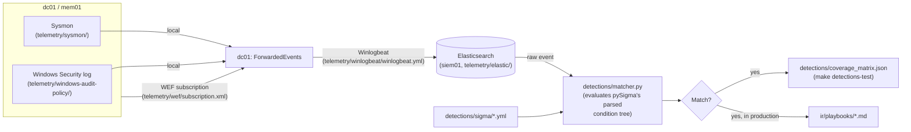
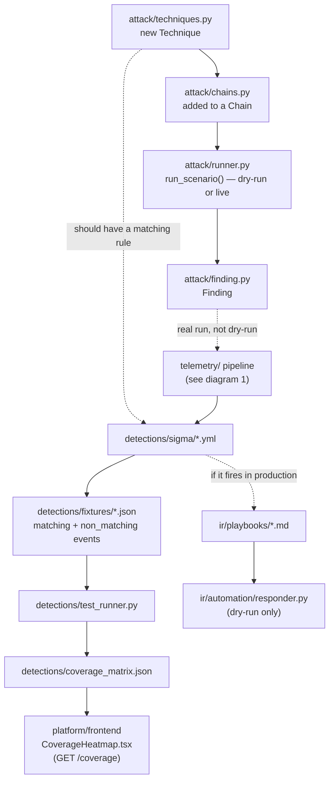

# Architecture diagrams

Companion to the high-level diagram in [README.md](../README.md) — these
three focus on how data actually flows through the system, rather than
which hosts exist. All three describe **intended, code-level** behavior;
none have been observed end-to-end against a running lab (see
[ROADMAP.md](../ROADMAP.md)).

## 1. Telemetry data flow

How an event on `dc01`/`mem01` reaches a Sigma rule verdict. See
[ADR 0006](adr/0006-telemetry-architecture.md) for why WEF + a single
Winlogbeat shipper was chosen over per-host shippers.



## 2. Attack chain: `domain_dominance`

`attack/chains.py`'s longer chain, showing which host each technique
actually connects to (not always the host it's conceptually "about" — see
[`attack/techniques.py`](../attack/techniques.py)'s module docstring).

```mermaid
sequenceDiagram
    participant Attacker as attacker01
    participant DC as dc01
    participant Mem as mem01 (unconstrained delegation)

    Note over Attacker,DC: 1. bloodhound_collect (T1087.002)
    Attacker->>DC: LDAP bind + bulk enumeration
    DC-->>Attacker: users, groups, ACL edges (incl. helpdesk-jsmith -> GenericAll -> Domain-Backups)

    Note over Attacker,DC: 2. acl_genericall_abuse (T1098)
    Attacker->>DC: Exercise GenericAll as helpdesk-jsmith
    DC-->>Attacker: password reset succeeds

    Note over Attacker,DC,Mem: 3. unconstrained_delegation_coerce (T1187)
    Attacker->>DC: Coerce authentication (PetitPotam-style, MS-EFSR)
    DC->>Mem: Authenticates (unconstrained delegation captures the ticket)
    Mem-->>Attacker: Captured TGT for DC01$

    Note over Attacker,DC: 4. dcsync (T1003.006)
    Attacker->>DC: DRSUAPI replication request, using DC01$ ticket
    DC-->>Attacker: krbtgt + Administrator credential material
    Note over Attacker,DC: Domain dominance achieved
```

## 3. Purple-team loop

The loop this whole project is built around — every attack technique is
expected to have a working detection before it's considered "done," not
just "executable."


